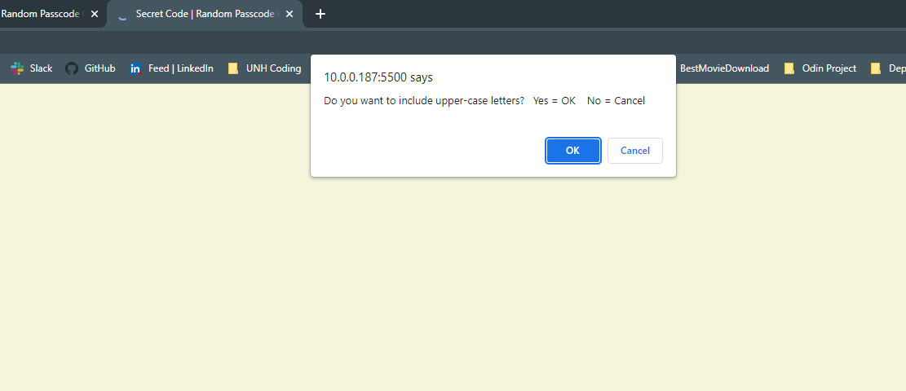
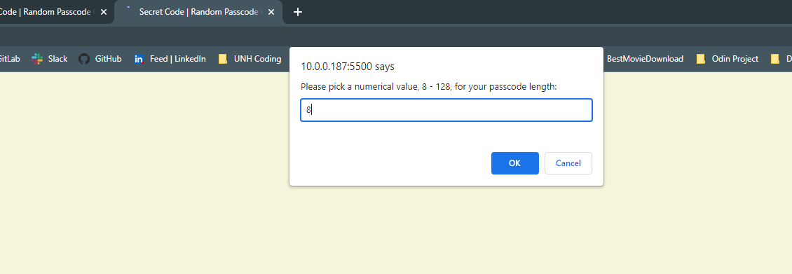
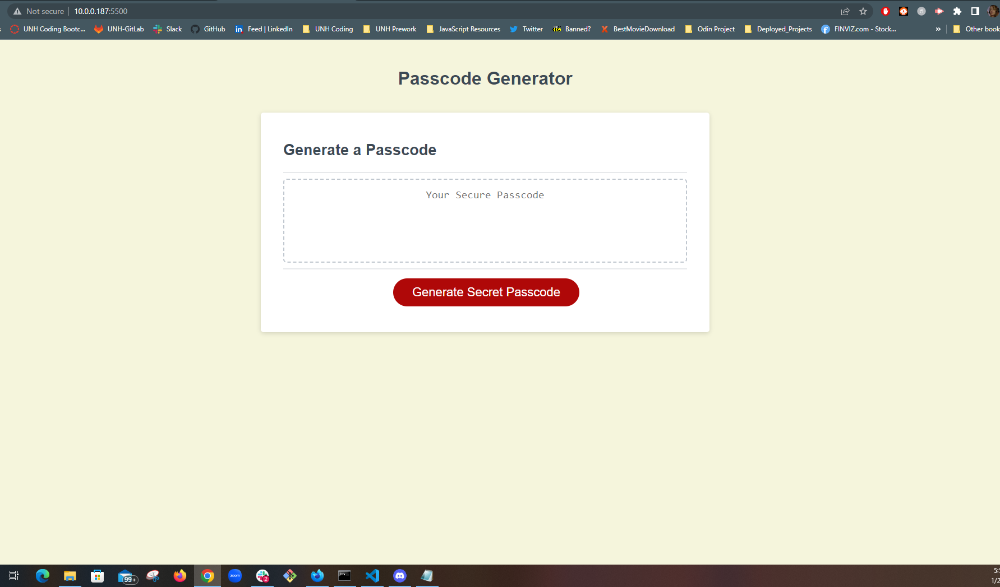

# Secret-Pass-Code Generator

## Description

My motivation for this project was to become more familiar with manipulating the DOM through vanilla javaScript. The logic was a learning hurdle for me, and though I did not complete all of the acceptance criteria, I learned many new things about functionality.

## Usage








## Credits

Special thanks to my BootcampSpot Tutor: Sheetal Srikumar (see comments in the javaScript file).

## License

Please see this project's GitHub repository for license information.

## Live Deployment
https://nietru.github.io/secret-pass-code/

## User Story

```
AS AN employee with access to sensitive data
I WANT to randomly generate a password that meets certain criteria
SO THAT I can create a strong password that provides greater security
```

## Acceptance Criteria

```
GIVEN I need a new, secure password
WHEN I click the button to generate a password
THEN I am presented with a series of prompts for password criteria
WHEN prompted for password criteria
THEN I select which criteria to include in the password
WHEN prompted for the length of the password
THEN I choose a length of at least 8 characters and no more than 128 characters
WHEN asked for character types to include in the password
THEN I confirm whether or not to include lowercase, uppercase, numeric, and/or special characters
WHEN I answer each prompt
THEN my input should be validated and at least one character type should be selected
WHEN all prompts are answered
THEN a password is generated that matches the selected criteria
WHEN the password is generated
THEN the password is either displayed in an alert or written to the page
```
